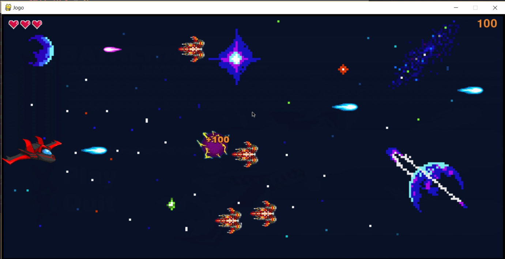

# Batalha Espacial com Arnold Schwarzenegger

Jogo desenvolvido como projeto final da disciplina de Programação Orientada Objeto, USP - ICMC - 02o/2018

Este jogo foi feito em cima da biblioteca pygames, sendo um jogo Arcade 2D. Nele, você controla uma nave espacial, atirando e desviando dos inimigos para ganhar pontos e sobreviver. Alguns upgrades aparecem ocasionalmente, um deles fazendo com que o Arnold Schwarzenegger apareca e destrua todos inimigos vivos no momento.

Além disso, esse jogo pode ser compilado em um instalador através do script [setup.py](./setup.py), que utiliza a biblioteca cx_Freeze.

## Pastas e Arquivos

- [/imagens](./imagens) : Pasta contendo imagens utilizadas como sprite do jogo.
- [jogo.py](./jogo.py) : Arquivo contendo o código fonte do jogo.
- [setup.py](./setup.py) : Arquivo com script de compilação do jogo através da biblioteca cx_Freeze
- [Diagrama.png](./Diagrama.png) : Diagrama de classes do projeto.

## Como Executar

Para executar o jogo, você deve instalar as dependencias necessárias para conseguir excutar o arquivo jogo.py.

    pip install pygame
    python jogo.py

Outra alternativa é criar um instalador através da biblioteca cx_Freeze e executar o jogo com o binário gerado, após instalado.

    pip install cx_Freeze --upgrade
    python setup.py bdist_msi

## Como Jogar

- As teclas de 'seta' do teclado movimentam a nave.
- A tecla 'espaço' atira e seleciona no menu.
- A tecla 'P' pausa.

## Imagens de exemplo

